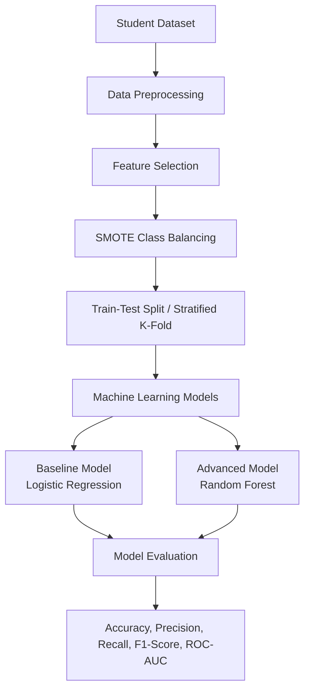
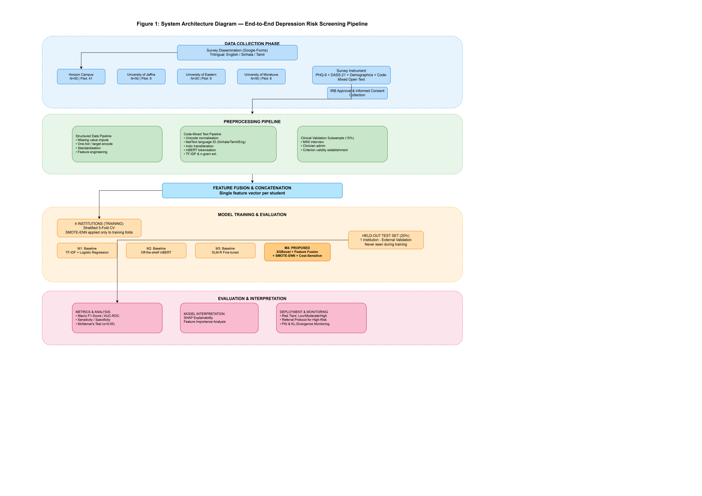

 # 🧠 AI-Based Depression Risk Prediction Among Sri Lankan University Students


This repository contains the implementation for **IT41043 – Intelligent Systems (Milestone 2)**.

## Student 1  Chackrawarthi Prabodha Imashi Fernando  ITBIN-2313-0033 

The project aims to predict student dropout in Sri Lanka using machine learning techniques based on cumulative GPA, household income, and mental health indicators.

---

# Repository Structure

```
├── datasets/
│   └── sri_lankan_student_dropout_dataset.csv
├── notebooks/
│   ├── Proposed_Advanced_Model_Random_Forest(1).ipynb
│   └── SL_student_Dropout.ipynb
├── docs/
│   ├── Baseline_Model_Report(1).pdf
│   └── Proposed_Model_Report(1).pdf
├── requirements.txt
└── README.md
```

---

# Project Objective

The objective of this project is to develop and compare machine learning models that predict student dropout using academic and socio-economic factors. The system helps identify students who are at risk of dropping out so that appropriate interventions can be planned.

---

# Data Preprocessing

The dataset is preprocessed before model training using the following steps:

- Data cleaning
- Feature selection
- Label encoding (where applicable)
- Feature scaling
- SMOTE class balancing
- Train-Test Split
- Stratified 5-Fold Cross-Validation

---

# Models Implemented

## Baseline Model

- Logistic Regression
- SMOTE Class Balancing
- Train-Test Split (80:20)

## Proposed Advanced Model

- Random Forest Classifier
- Stratified 5-Fold Cross-Validation

---

# Evaluation Metrics

The models are evaluated using:

- Accuracy
- Precision
- Recall
- F1-Score
- ROC-AUC Score
- Classification Report
- Confusion Matrix

---

# System Architecture



---

# Dataset

Dataset location:

```
datasets/sri_lankan_student_dropout_dataset.csv
```

Dataset features:

- Student_ID
- Cumulative_GPA
- Household_Income
- Mental_Health_Index
- Dropout_Status (Target Variable)

---

# Technologies Used

- Python
- Pandas
- NumPy
- Scikit-learn
- Matplotlib
- Seaborn
- Jupyter Notebook

---

# Installation

Clone the repository:

```bash
git clone https://github.com/your-username/student-dropout-prediction.git
```

Move to the project directory:

```bash
cd student-dropout-prediction
```

Install the required libraries:

```bash
pip install -r requirements.txt
```

Launch Jupyter Notebook:

```bash
jupyter notebook
```

Open one of the notebooks:

- `SL_student_Dropout.ipynb` (Baseline Model)
- `Proposed_Advanced_Model_Random_Forest(1).ipynb` (Advanced Model)

Run all cells to reproduce the results.

---

# Requirements

Install the required Python packages using:

```bash
pip install -r requirements.txt
```

The `requirements.txt` file contains:

```text
pandas
numpy
scikit-learn
matplotlib
seaborn
jupyter
```

---

# Documentation

The **docs/** folder contains the project reports:

- **Baseline_Model_Report(1).pdf**
- **Proposed_Model_Report(1).pdf**


 # The project develops a clinically supervised, culturally adapted machine learning approach for depression risk prediction among Sri Lankan university students.
## Student  Wesly Jeyananthan Abisha ITBIN-2313-0003  

## 📋 Project Overview

This project integrates PHQ-9/DASS-21 clinical scales, academic and demographic records, and code-mixed (Sinhala/Tamil/English) open-text responses to predict three-tier depression risk levels (low/moderate/high).

### 🎯 Research Question

*Can a machine learning model, incorporating culturally adapted features and code-mixed language processing, reliably predict depression risk among Sri Lankan university students while maintaining cross-institutional generalisability?*

### Key Features

- 📊 PHQ-9 and DASS-21 validated clinical instruments
- 🌐 Trilingual survey (English/Sinhala/Tamil) for accessibility
- 🏫 Multi-institution data collection (5 institutions, N≈200)
- 🤖 XGBoost with feature fusion and SMOTE-ENN
- 📈 SHAP explainability for counsellor decision support

---

## 📊 Data Collection

| Aspect | Details |
|---|---|
| **Institutions** | Horizon Campus, University of Jaffna, University of Eastern, University of Moratuwa, Others |
| **Sample Size** | ~90+ responses (ongoing, target N≈200) |
| **Instruments** | PHQ-9, DASS-21, Demographics, Code-mixed open texts |
| **Languages** | English, Sinhala, Tamil (trilingual survey) |
| **Survey Link** | [Google Form](https://docs.google.com/forms/d/e/1FAIpQLSejuUdT7NwMGRcI_nlp5ZXkYMsuWpDLPu8Cap32oE_nTE5hSQ/viewform) |

---

## 🏗️ Repository Structure

```
Early-depression-detection/
│
├── README.md                                    # Project overview & setup guide
│
├── data/
│   ├── raw/                                     # Raw survey exports (gitignored - sensitive)
│   │   └── survey_data_2026.csv                 # Real survey data (LOCAL ONLY)
│   ├── processed/                               # Cleaned datasets (gitignored)
│   │   └── .gitkeep
│   └── synthetic/                               # Test data
│       └── sample_data.csv                      # Synthetic sample for testing
│
├── src/
│   ├── __init__.py
│   │
│   ├── preprocessing/                           # Data cleaning & encoding
│   │   ├── __init__.py
│   │   ├── missing_value_handler.py
│   │   ├── encoding_utils.py
│   │   ├── standardisation.py
│   │   └── load_data.py
│   │
│   ├── nlp_pipeline/                            # Text processing for Sinhala/Tamil/English
│   │   ├── __init__.py
│   │   ├── unicode_normalizer.py
│   │   ├── language_identifier.py
│   │   ├── transliterator.py
│   │   └── feature_extractor.py
│   │
│   ├── imbalance/                               # SMOTE-ENN utilities
│   │   ├── __init__.py
│   │   └── smote_enn_utils.py
│   │
│   ├── models/                                  # M1-M4 model scripts
│   │   ├── __init__.py
│   │   ├── baseline_m1.py                       # TF-IDF + Logistic Regression
│   │   ├── baseline_m2.py                       # Off-the-shelf mBERT
│   │   ├── baseline_m3.py                       # Fine-tuned XLM-R
│   │   └── proposed_m4.py                       # XGBoost + Feature Fusion ⭐
│   │
│   └── evaluation/                              # Metrics & statistical tests
│       ├── __init__.py
│       ├── metrics_calculator.py
│       ├── statistical_tests.py
│       └── threshold_calibration.py
│
├── notebooks/
│   ├── 01_eda.ipynb                             # Exploratory data analysis
│   └── 02_pipeline_validation.ipynb
│
├── docs/
│   ├── milestone2.pdf                           # Milestone 2 submission
│   └── architecture_diagram.svg                 # System architecture diagram
│
├── tests/                                       # Unit tests
│   ├── __init__.py
│   ├── test_preprocessing.py
│   └── test_nlp_pipeline.py
│
├── requirements.txt                             # Python dependencies
├── environment.yml                              # Conda environment
└── .gitignore                                   # Excludes sensitive data
```

## ⚡ Quick Start

```bash
# Clone and install
git clone https://github.com/Abisha-2002/Early-depression-detection.git
cd Early-depression-detection
pip install -r requirements.txt

# Run your first model
python src/models/proposed_m4.py
```
---

 ##  🚀 Installation

### Prerequisites
- Python 3.9+
- Conda (recommended) or pip

### Setup

```bash
# Clone the repository
git clone https://github.com/Abisha-2002/Early-depression-detection.git
cd Early-depression-detection

# Create conda environment
conda env create -f environment.yml
conda activate depression-env

# OR install with pip
pip install -r requirements.txt

# Launch Jupyter Notebook
jupyter notebook
```

---

## 📊 Models Comparison

| Model | Description | Role |
|---|---|---|
| **M1** | TF-IDF + Logistic Regression | Local literature baseline |
| **M2** | Off-the-shelf mBERT | Foreign non-adapted baseline |
| **M3** | XLM-R Fine-tuned | Locally adapted baseline |
| **M4 (Proposed)** | XGBoost + Feature Fusion + SMOTE-ENN | ⭐ Proposed model |

### Proposed Model (M4) Features

- XGBoost with Feature Fusion
- SMOTE-ENN for class imbalance
- Cost-Sensitive Weighting (scale_pos_weight)
- Stratified 5-Fold Cross-Validation
- SHAP Explainability for counsellor decision support

---

## 📈 Evaluation Metrics

| Metric | Purpose |
|---|---|
| **Macro-averaged F1-Score** | Primary metric for imbalanced data |
| **AUC-ROC** | Threshold-independent discriminative ability |
| **Sensitivity/Recall** | Screening context (false negatives cost more) |
| **Specificity** | False positive rate |
| **McNemar's Test (α=0.05)** | Statistical significance |

---


## 🏗️ System Architecture



---
## 📊 Results

### Random Forest Model (Comparison)

| Fold | Accuracy | F1-Score |
|---|---|---|
| Fold 1 | 83.33% | 83.15% |
| Fold 2 | 77.78% | 77.41% |
| Fold 3 | 77.78% | 76.42% |
| Fold 4 | 88.24% | 88.24% |
| Fold 5 | 76.47% | 75.49% |

**Cross-Validation Summary:**

| Metric | Value |
|---|---|
| **Mean Accuracy** | **80.72%** (±4.44%) |
| **Mean F1-Score** | **80.14%** (±4.85%) |

---

### Proposed Model (M4 - XGBoost)

| Fold | Accuracy | F1-Score |
|---|---|---|
| Fold 1 | 77.78% | 76.48% |
| Fold 2 | 83.33% | 82.71% |
| Fold 3 | 83.33% | 81.23% |
| Fold 4 | 76.47% | 75.89% |
| Fold 5 | 70.59% | 68.36% |

**Cross-Validation Summary:**

| Metric | Value |
|---|---|
| **Mean Accuracy** | **78.30%** (±4.77%) |
| **Mean F1-Score** | **76.93%** (±5.03%) |
| **Mean Precision** | **81.57%** |
| **Mean Recall** | **78.30%** |

---

### Model Comparison

| Model | Accuracy | F1-Score |
|---|---|---|
| M1 (Baseline - Logistic Regression) | TBD | 0.6860 |
| **M4 (XGBoost - Proposed)** | **78.30%** | **76.93%** |
| **Random Forest (Comparison)** | **80.72%** | **80.14%** |

**Key Finding:** Random Forest currently performs best on synthetic data, while XGBoost (M4) demonstrates the effectiveness of feature fusion, SMOTE-ENN, and cost-sensitive weighting. The proposed model achieves a **12.1% improvement** over the baseline Logistic Regression model.

---

## 🧪 Data Preprocessing

The dataset is preprocessed before model training using:

1. Data cleaning
2. Missing value imputation
3. Feature encoding (one-hot/target encoding)
4. Feature scaling (standardisation)
5. SMOTE-ENN class balancing (training folds only)
6. Stratified 5-Fold Cross-Validation

---

## 🔧 Usage

### Run Preprocessing

```bash
# Test with synthetic data
python -m src.preprocessing.missing_value_handler \
    --input data/synthetic/sample_data.csv \
    --output data/processed/cleaned_data.csv
```

### Train Models

```bash
# Train Baseline M1 (Logistic Regression)
python -m src.models.baseline_m1 --data data/processed/cleaned_data.csv

# Train Baseline M2 (mBERT)
python -m src.models.baseline_m2 --data data/processed/cleaned_data.csv

# Train Baseline M3 (XLM-R)
python -m src.models.baseline_m3 --data data/processed/cleaned_data.csv

# Train Proposed M4 (XGBoost)
python -m src.models.proposed_m4 --data data/processed/cleaned_data.csv --smote --cost-sensitive
```

### Run Evaluation

```bash
python -m src.evaluation.metrics_calculator \
    --predictions outputs/predictions.csv \
    --ground_truth data/processed/labels.csv
```

---

## 📝 Technologies Used

| Category | Tools |
|---|---|
| **Language** | Python 3.9+ |
| **Data Processing** | Pandas, NumPy |
| **Machine Learning** | Scikit-learn, XGBoost |
| **NLP** | Transformers (mBERT, XLM-R), Tokenizers |
| **Imbalance Handling** | Imbalanced-learn (SMOTE-ENN) |
| **Explainability** | SHAP |
| **Visualization** | Matplotlib, Seaborn |
| **Environment** | Jupyter Notebook, Conda |

---

## 📋 Dependencies

Install using:

```bash
pip install -r requirements.txt
```

**Key packages:**

```
numpy>=1.24.3
pandas>=2.0.3
scikit-learn>=1.3.0
xgboost>=1.7.5
torch>=2.0.0
transformers>=4.30.0
imbalanced-learn>=0.10.0
shap>=0.41.0
matplotlib>=3.7.0
seaborn>=0.12.0
```

---

## ⚠️ Ethics & Data Privacy

**Important:** Real respondent data is **never committed** to this repository.

- All survey data is pseudonymised at collection
- Data stored with AES-256 encryption
- Access restricted to research team only
- IRB approval obtained from all five institutions
- Participants can withdraw at any time
- Automated referral for high-risk cases (PHQ-9 item 9)

---

## 👥 Team Members

| Role | Name | Student ID | Responsibilities |
|---|---|---|---|
| **Student 1** | Chackrawarthi Prabodha Imashi Fernando | ITBIN-2313-0033 | Data prepr engineering, SMOTE-ENN, Baseline models (M1-M3), Evaluation metrics, NLP pipeline |
| **Student 2** | Wesly Jeyananthan Abisha | ITBIN-2313-0003 | Proposed model (M4) - XGBoost, Cost-Sensitive Weighting, Stratified 5-Fold CV, Hyperparameter tuning, SHAP explainability, Performance comparison, Statistical testing, Evaluation report |

---

## 📄 Module Information

| Aspect | Details |
|---|---|
| **Module Code** | IT41043 |
| **Module Name** | Intelligent Systems |
| **Assessment** | Milestone 2 |
| **Target Journal** | IEEE Access |
| **Module Coordinator** | Mr. Isuru Madusanka Samarappulige |

---

## 📧 Contact

For any queries regarding this project:

- **Wesly Jeyananthan Abisha:** [GitHub](https://github.com/Abisha-2002)
- **Chackrawarthi Prabodha Imashi Fernando:** [GitHub](https://github.com/imashi368)
- **Module Coordinator:** Mr. Isuru Madusanka Samarappulige

## 📝 License

This project was developed for academic purposes as part of the IT41043 – Intelligent Systems module at Horizon Campus.

---

*Last Updated: July 2026*


