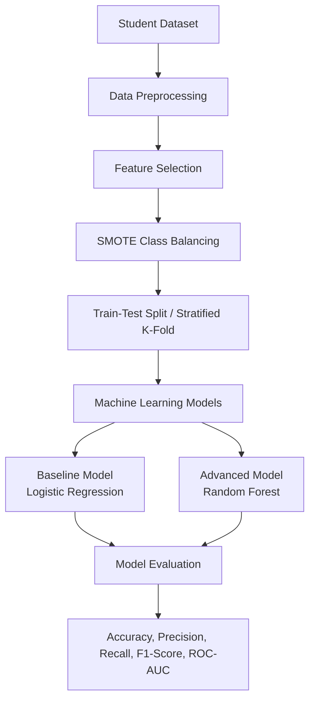
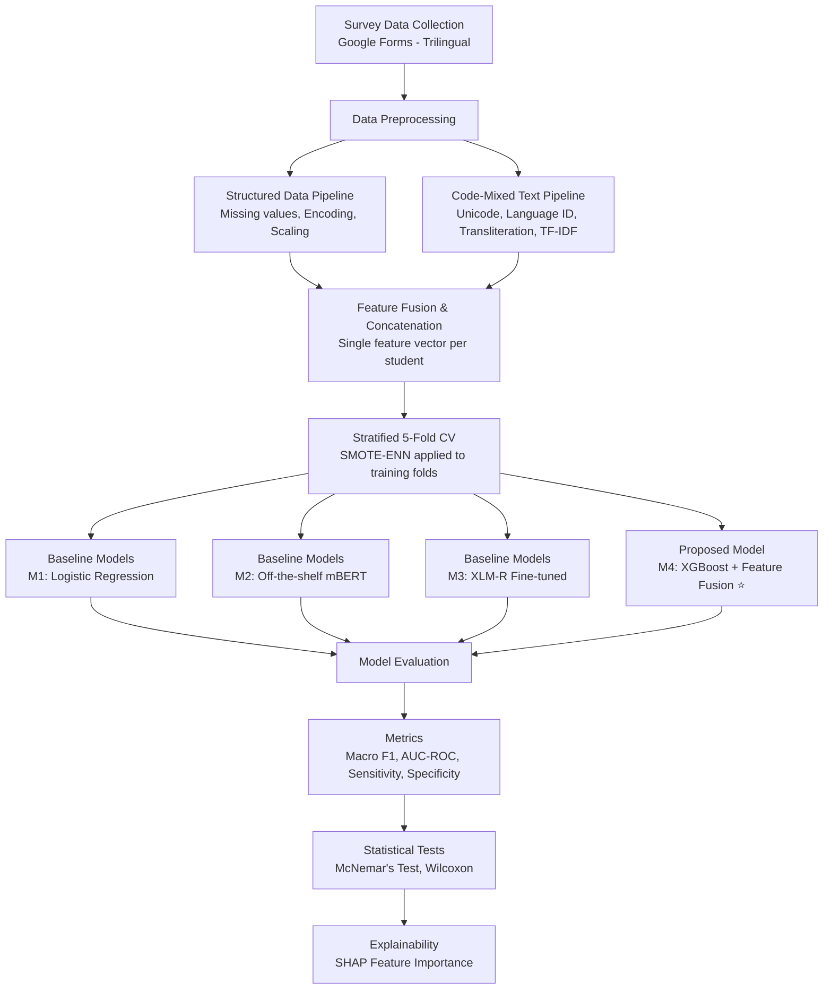

# AI-Based Student Dropout and Mental Health Risk Prediction Among Sri Lankan University Students: A Machine Learning Approach

This repository contains the implementation for **IT41043 – Intelligent Systems (Milestone 2)**. The project aims to predict student dropout in Sri Lanka using machine learning techniques based on cumulative GPA, household income, and mental health indicators.

---

# Repository Structure

```
├── datasets/
│   └── sri_lankan_student_dropout_dataset.csv
├── notebooks/
│   ├── Proposed_Advanced_Model_Random_Forest(1).ipynb
│   └── SL_student_Dropout.ipynb
├── docs/
│   ├── Baseline_Model_Report(1).pdf
│   └── Proposed_Model_Report(1).pdf
├── requirements.txt
└── README.md
```

---

# Project Objective

The objective of this project is to develop and compare machine learning models that predict student dropout using academic and socio-economic factors. The system helps identify students who are at risk of dropping out so that appropriate interventions can be planned.

---

# Data Preprocessing

The dataset is preprocessed before model training using the following steps:

- Data cleaning
- Feature selection
- Label encoding (where applicable)
- Feature scaling
- SMOTE class balancing
- Train-Test Split
- Stratified 5-Fold Cross-Validation

---

# Models Implemented

## Baseline Model

- Logistic Regression
- SMOTE Class Balancing
- Train-Test Split (80:20)

## Proposed Advanced Model

- Random Forest Classifier
- Stratified 5-Fold Cross-Validation

---

# Evaluation Metrics

The models are evaluated using:

- Accuracy
- Precision
- Recall
- F1-Score
- ROC-AUC Score
- Classification Report
- Confusion Matrix

---

# System Architecture



---

# Dataset

Dataset location:

```
datasets/sri_lankan_student_dropout_dataset.csv
```

Dataset features:

- Student_ID
- Cumulative_GPA
- Household_Income
- Mental_Health_Index
- Dropout_Status (Target Variable)

---

# Technologies Used

- Python
- Pandas
- NumPy
- Scikit-learn
- Matplotlib
- Seaborn
- Jupyter Notebook

---

# Installation

Clone the repository:

```bash
git clone https://github.com/your-username/student-dropout-prediction.git
```

Move to the project directory:

```bash
cd student-dropout-prediction
```

Install the required libraries:

```bash
pip install -r requirements.txt
```

Launch Jupyter Notebook:

```bash
jupyter notebook
```

Open one of the notebooks:

- `SL_student_Dropout.ipynb` (Baseline Model)
- `Proposed_Advanced_Model_Random_Forest(1).ipynb` (Advanced Model)

Run all cells to reproduce the results.

---

# Requirements

Install the required Python packages using:

```bash
pip install -r requirements.txt
```

The `requirements.txt` file contains:

```text
pandas
numpy
scikit-learn
matplotlib
seaborn
jupyter
```

---

# Documentation

The **docs/** folder contains the project reports:

- **Baseline_Model_Report(1).pdf**
- **Proposed_Model_Report(1).pdf**


# Part 2: AI-Based Depression Risk Prediction Among Sri Lankan University Students
Overview
This project develops a clinically supervised, culturally adapted machine learning approach for depression risk prediction among Sri Lankan university students. The system integrates PHQ-9/DASS-21 clinical scales, academic and demographic records, and code-mixed (Sinhala/Tamil/English) open-text responses to predict three-tier depression risk levels (low/moderate/high).

Key Features:

📊 PHQ-9 and DASS-21 validated clinical instruments

🌐 Trilingual survey (English/Sinhala/Tamil) for accessibility

🏫 Multi-institution data collection (5 institutions, N≈200)

🤖 XGBoost with feature fusion and SMOTE-ENN

📈 SHAP explainability for counsellor decision support

Research Question
Can a machine learning model, incorporating culturally adapted features and code-mixed language processing, reliably predict depression risk among Sri Lankan university students while maintaining cross-institutional generalisability?

 # Depression Prediction Repository Structure

```
Early-depression-detection/
│
├── README.md                                    # Project overview & setup guide

│
├── data/
│   ├── raw/                                     # Raw survey exports (gitignored - sensitive)
│   │   └── survey_data_2026.csv                 # Real survey data (LOCAL ONLY)
│   ├── processed/                               # Cleaned datasets (gitignored)
│   │   └── .gitkeep
│   └── synthetic/                               # Test data
│       └── sample_data.csv                      # Synthetic sample for testing
│

├── src/
│   ├── __init__.py
│   │
│   ├── preprocessing/                           # Data cleaning & encoding
│   │   ├── __init__.py
│   │   ├── missing_value_handler.py
│   │   ├── encoding_utils.py
│   │   ├── standardisation.py
│   │   └── load_data.py
│   │
│   ├── nlp_pipeline/                            # Text processing for Sinhala/Tamil/English
│   │   ├── __init__.py
│   │   ├── unicode_normalizer.py
│   │   ├── language_identifier.py
│   │   ├── transliterator.py
│   │   └── feature_extractor.py
│   │
│   ├── imbalance/                               # SMOTE-ENN utilities
│   │   ├── __init__.py
│   │   └── smote_enn_utils.py
│   │
│   ├── models/                                  # M1-M4 model scripts
│   │   ├── __init__.py
│   │   ├── baseline_m1.py                       # TF-IDF + Logistic Regression
│   │   ├── baseline_m2.py                       # Off-the-shelf mBERT
│   │   ├── baseline_m3.py                       # Fine-tuned XLM-R
│   │   └── proposed_m4.py                       # XGBoost + Feature Fusion ⭐
│   │
│   └── evaluation/                              # Metrics & statistical tests
│       ├── __init__.py
│       ├── metrics_calculator.py
│       ├── statistical_tests.py
│       └── threshold_calibration.py
│
├── notebooks/
│   ├── 01_eda.ipynb                             # Exploratory data analysis
│   └── 02_pipeline_validation.ipynb
│
├── docs/
│   ├── milestone2.pdf                           # Milestone 2 submission
│   └── architecture_diagram.svg                 # System architecture diagram
│
├── tests/                                       # Unit tests
│   ├── __init__.py
│   ├── test_preprocessing.py
│   └── test_nlp_pipeline.py
│
├── requirements.txt                             # Python dependencies
├── environment.yml                              # Conda environment
└── .gitignore                                   # Excludes sensitive data
```
 # Depression Prediction Current Status
Milestone 2 — Methodology and Data Description Complete

✅ Dataset design finalised (N ≈ 200 across 5 institutions)

✅ Pilot data collected (n=93) validating instrument and collection approach

✅ Preprocessing pipeline implemented

✅ Model architecture designed (XGBoost with feature fusion)

✅ Baselines defined (M1-M3)

✅ Evaluation plan finalised

✅ Synthetic data for testing added

⏳ Pending full IRB approval and expanded data collection

# Depression Prediction Survey Link
🔗 Survey: https://docs.google.com/forms/d/e/1FAIpQLSejuUdT7NwMGRcI_nlp5ZXkYMsuWpDLPu8Cap32oE_nTE5hSQ/viewform

# Depression Prediction Data Preprocessing
The dataset is preprocessed before model training using the following steps:

Data cleaning

Missing value imputation

Feature encoding (one-hot/target encoding)

Feature scaling (standardisation)

SMOTE-ENN class balancing

Train-Test Split

Stratified 5-Fold Cross-Validation
# Depression Prediction Models Implemented
Baseline Models (M1-M3)
Model	Description	Role
M1	TF-IDF + Logistic Regression	Local literature baseline
M2	Off-the-shelf mBERT	Foreign non-adapted baseline
M3	XLM-R Fine-tuned	Locally adapted baseline
Proposed Model (M4)
XGBoost with Feature Fusion

SMOTE-ENN for class imbalance

Cost-Sensitive Weighting (scale_pos_weight)

Stratified 5-Fold Cross-Validation

SHAP Explainability for counsellor decision support

 # Depression Prediction Evaluation Metrics
The models are evaluated using:

Macro-averaged F1-Score (primary metric for imbalanced data)

AUC-ROC (threshold-independent discriminative ability)

Sensitivity/Recall at calibrated threshold (screening context)

Specificity (false positive rate)

McNemar's Test (α=0.05) for statistical significance

 # Depression Prediction System Architecture

## Installation
### Clone the Repository

```bash
git clone https://github.com/Abisha-2002/Early-depression-detection.git
cd Early-depression-detection
```
Create and activate the conda environment
```
conda env create -f environment.yml
conda activate early-depression-detection
```
Install the required libraries
```
pip install -r requirements.txt
```
Launch Jupyter Notebook
```
jupyter notebook
```
Open the Notebooks
notebooks/01_eda.ipynb - Exploratory Data Analysis
Train Baseline Models
```
python src/models/baseline_m1.py --data data/processed/cleaned_data.csv
python src/models/baseline_m2.py --data data/processed/cleaned_data.csv
python src/models/baseline_m3.py --data data/processed/cleaned_data.csv
```
Train Proposed Model (XGBoost - M4)
```
python src/models/proposed_m4.py --data data/processed/cleaned_data.csv --smote --cost-sensitive
```
 # Depression Prediction Technologies Used
 Python 3.9
Pandas, NumPy
Scikit-learn
XGBoost
Imbalanced-learn (SMOTE-ENN)
Transformers (mBERT, XLM-R)
SHAP
Matplotlib, Seaborn
Jupyter Notebook

# Depression Prediction Ethics & Data Privacy
⚠️ Important: Real respondent data is never committed to this repository.

All survey data is pseudonymised at collection

Data stored with AES-256 encryption

Access restricted to research team only

IRB approval pending at all five institutions

Participants can withdraw at any time

Automated referral for high-risk cases (PHQ-9 item 9)
## Group Details

### Student 1

**Name:** Chackrawarthi Prabodha Imashi Fernando

**Student ID:** ITBIN-2313-0033

#### Responsibilities

- Data preprocessing (missing value imputation, encoding, standardisation)
- Feature selection and engineering
- SMOTE-ENN class balancing
- Baseline models implementation (M1, M2, M3)
- Model evaluation and metrics calculation
- NLP pipeline for code-mixed text processing

---

### Student 2

**Name:** Wesly Jeyananthan Abisha

**Student ID:** ITBIN-2313-0003

#### Responsibilities

- Proposed model (M4) implementation - XGBoost with Feature Fusion
- Cost-Sensitive Weighting (scale_pos_weight)
- Stratified 5-Fold Cross-Validation
- Hyperparameter tuning (GridSearchCV)
- SHAP explainability for model interpretation
- Performance comparison and statistical testing
- Evaluation report generation
Depression Prediction Module Information
Module Code: IT41043

Module Name: Intelligent Systems

Assessment: Milestone 2

Target Journal: IEEE Access

# Depression Prediction License
This project was developed for academic purposes as part of the IT41043 – Intelligent Systems module.
