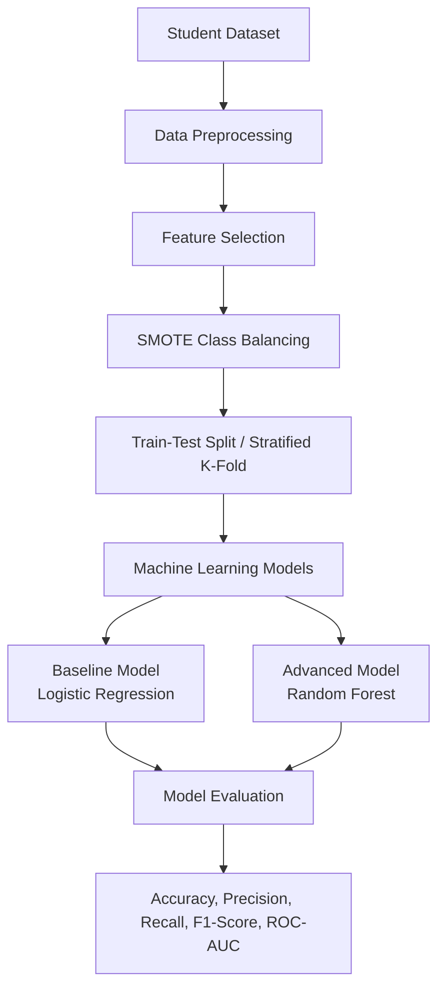

# Sri Lankan Student Dropout Prediction System

This repository contains the implementation for **IT41043 – Intelligent Systems (Milestone 2)**. The project aims to predict student dropout in Sri Lanka using machine learning techniques based on cumulative GPA, household income, and mental health indicators.

---

# Repository Structure

```
├── datasets/
│   └── sri_lankan_student_dropout_dataset.csv
├── notebooks/
│   ├── Proposed_Advanced_Model_Random_Forest(1).ipynb
│   └── SL_student_Dropout.ipynb
├── docs/
│   ├── Baseline_Model_Report(1).pdf
│   └── Proposed_Model_Report(1).pdf
├── requirements.txt
└── README.md
```

---

# Project Objective

The objective of this project is to develop and compare machine learning models that predict student dropout using academic and socio-economic factors. The system helps identify students who are at risk of dropping out so that appropriate interventions can be planned.

---

# Data Preprocessing

The dataset is preprocessed before model training using the following steps:

- Data cleaning
- Feature selection
- Label encoding (where applicable)
- Feature scaling
- SMOTE class balancing
- Train-Test Split
- Stratified 5-Fold Cross-Validation

---

# Models Implemented

## Baseline Model

- Logistic Regression
- SMOTE Class Balancing
- Train-Test Split (80:20)

## Proposed Advanced Model

- Random Forest Classifier
- Stratified 5-Fold Cross-Validation

---

# Evaluation Metrics

The models are evaluated using:

- Accuracy
- Precision
- Recall
- F1-Score
- ROC-AUC Score
- Classification Report
- Confusion Matrix

---

# System Architecture



---

# Dataset

Dataset location:

```
datasets/sri_lankan_student_dropout_dataset.csv
```

Dataset features:

- Student_ID
- Cumulative_GPA
- Household_Income
- Mental_Health_Index
- Dropout_Status (Target Variable)

---

# Technologies Used

- Python
- Pandas
- NumPy
- Scikit-learn
- Matplotlib
- Seaborn
- Jupyter Notebook

---

# Installation

Clone the repository:

```bash
git clone https://github.com/your-username/student-dropout-prediction.git
```

Move to the project directory:

```bash
cd student-dropout-prediction
```

Install the required libraries:

```bash
pip install -r requirements.txt
```

Launch Jupyter Notebook:

```bash
jupyter notebook
```

Open one of the notebooks:

- `SL_student_Dropout.ipynb` (Baseline Model)
- `Proposed_Advanced_Model_Random_Forest(1).ipynb` (Advanced Model)

Run all cells to reproduce the results.

---

# Requirements

Install the required Python packages using:

```bash
pip install -r requirements.txt
```

The `requirements.txt` file contains:

```text
pandas
numpy
scikit-learn
matplotlib
seaborn
jupyter
```

---

# Documentation

The **docs/** folder contains the project reports:

- **Baseline_Model_Report(1).pdf**
- **Proposed_Model_Report(1).pdf**

---

# Group Details

## Student 1

**Name:** Chackrawarthi Prabodha Imashi Fernando

**Student ID:** ITBIN-2313-0033

### Responsibilities

- Data preprocessing
- Feature selection
- SMOTE class balancing
- Baseline Logistic Regression implementation
- Model evaluation

---

## Student 2

**Name:** Wesly Jeyananthan Abisha

**Student ID:** ITBIN-2313-0003

### Responsibilities

- Random Forest Classifier implementation
- Stratified 5-Fold Cross-Validation
- Performance comparison
- Evaluation report generation

---

# Module Information

**Module Code:** IT41043

**Module Name:** Intelligent Systems

**Assessment:** Milestone 2

---

# License

This project was developed for academic purposes as part of the **IT41043 – Intelligent Systems** module.
